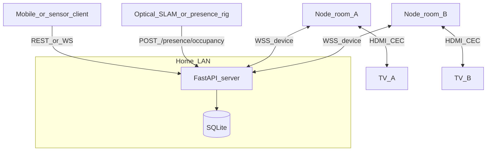

# Architecture

## Goals

- **Coordinator**: single source of truth for which **room** should have the “focused” TV.
- **Nodes**: one device per TV, connected to the **HDMI CEC** line, receiving commands over **WiFi** (WebSocket to the server).
- **Clients**: apps over **`/ws/app`**, REST handoffs, or **optical / SLAM pipelines** via **`POST /presence/occupancy`** (room + confidence).

## Honesty boundary

Commercial streaming apps do not expose a supported API for **frame-accurate** resume across TVs. This project implements:

- Session metadata you control (`content_ref`, `transport`).
- TV **control plane**: CEC messages, power, input selection.
- Orchestration: **standby or focus** policies when the active room changes.

## System diagram

## Message flow

1. Client sets **active session** (`home_id`, `active_room_id`, optional `content_ref`) — via REST, **`/ws/app`**, or **`POST /presence/occupancy`** when localization confidence exceeds the configured threshold.
2. **Coordinator** computes a **command batch**:
   - `focus` for the node in `active_room_id`.
   - Optional `standby_others` or `cec_user_control` for non-active nodes (policy flags).
3. Server pushes JSON over **`/ws/device`** to connected nodes for that `home_id`.
4. Node applies CEC or logs if CEC is disabled in dev.

## WebSocket protocol (summary)

- **Device → server**: `hello` (api_key, node_id, firmware version), `heartbeat`, `ack`, `event` (e.g. `cec_rx` debug).
- **Server → device**: `command_batch` with ordered commands: `cec_send`, `power_toggle`, `noop`, etc.

Schema version field: `v` in each message (currently `1`).

## Security

- **Per-node API key** (stored in NVS). Rotate via re-provisioning.
- **Home `control_token`**: returned on `POST /homes` and `POST /bootstrap/...`; required for **`/ws/app`** (presence / handoff from a companion app). Treat like a password; rotate with `POST /homes/{id}/rotate-control-token`.
- Production: TLS termination (reverse proxy), no anonymous MQTT.

## Risks

- **CEC** behavior varies by TV vendor; physical address and opcodes may need tuning.
- **HDMI compliance** and trademark if you productize a dongle—consult qualified legal/compliance review.
- WiFi latency and reconnects: firmware must **buffer** one batch and **dedupe** by `batch_id`.
